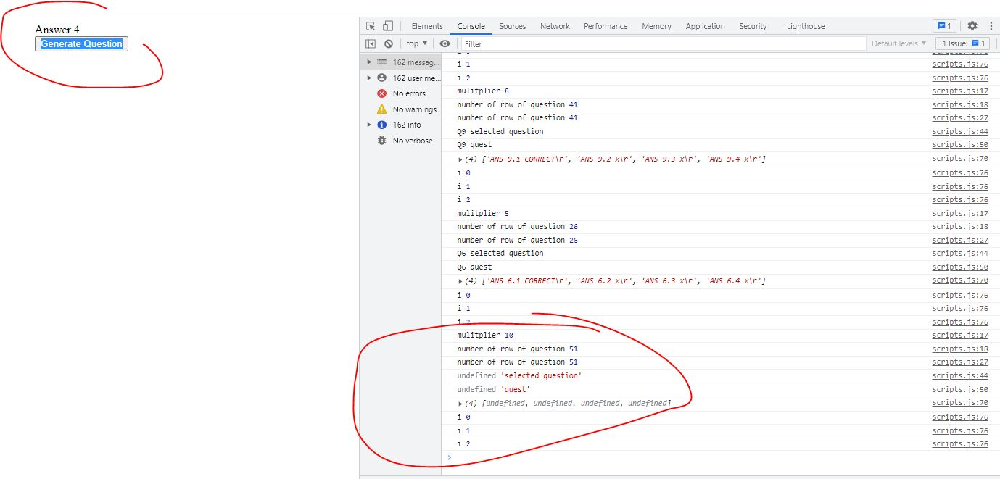
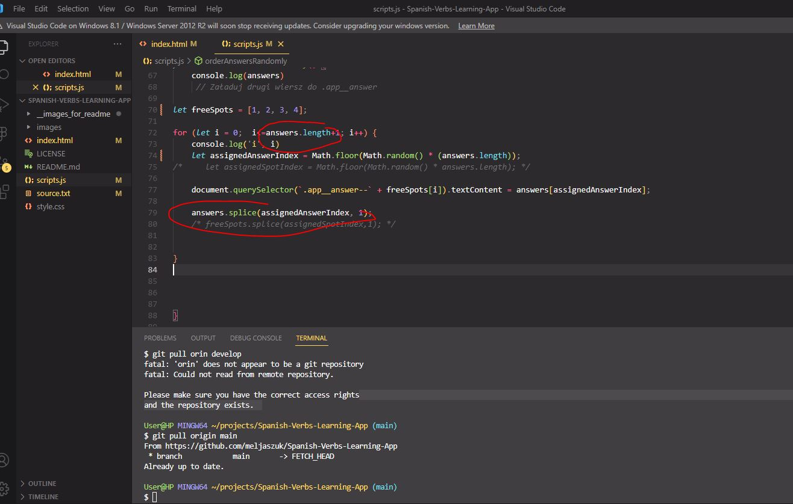
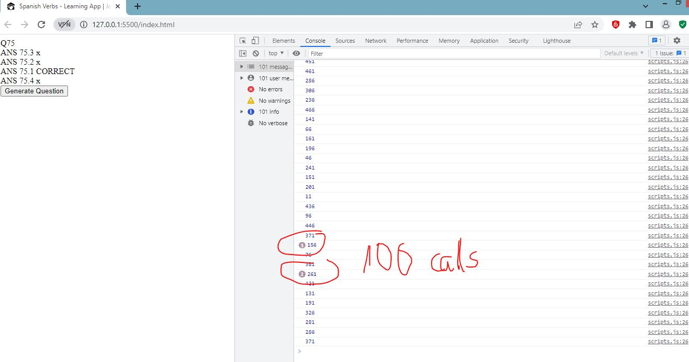
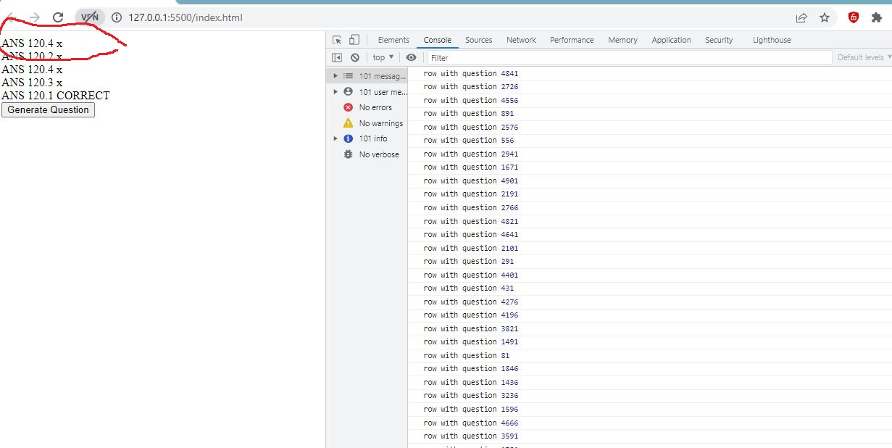
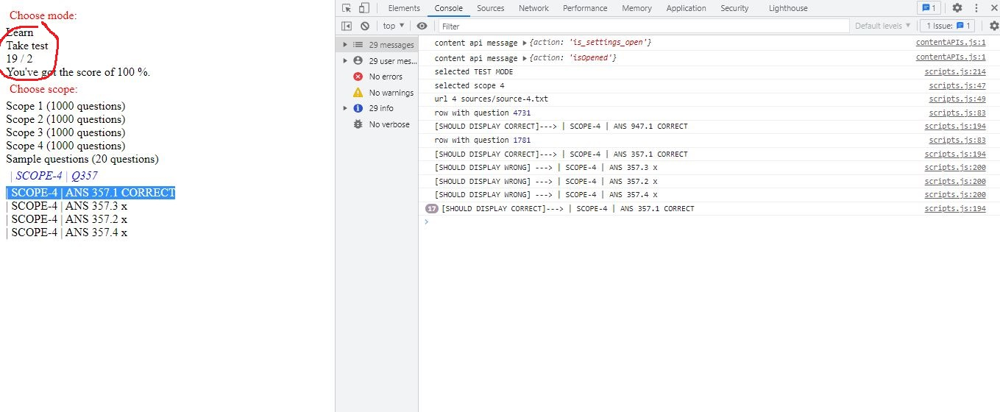
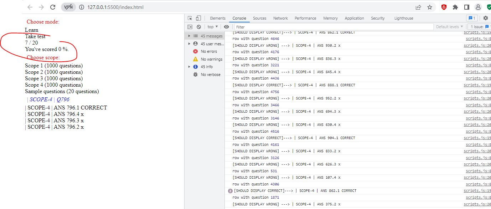
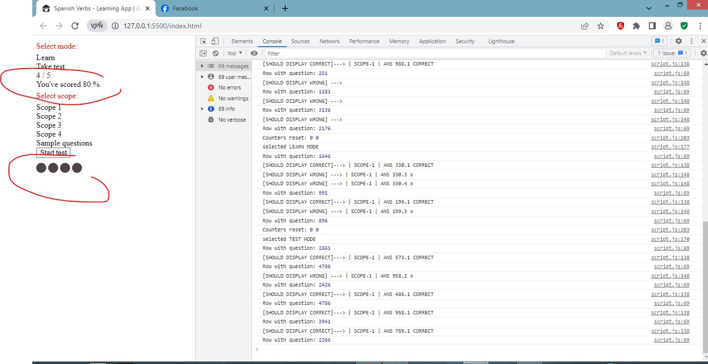
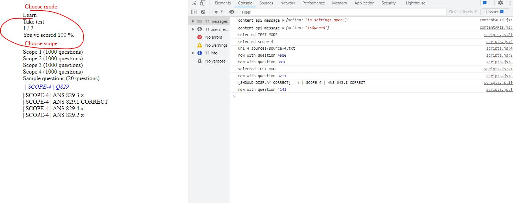
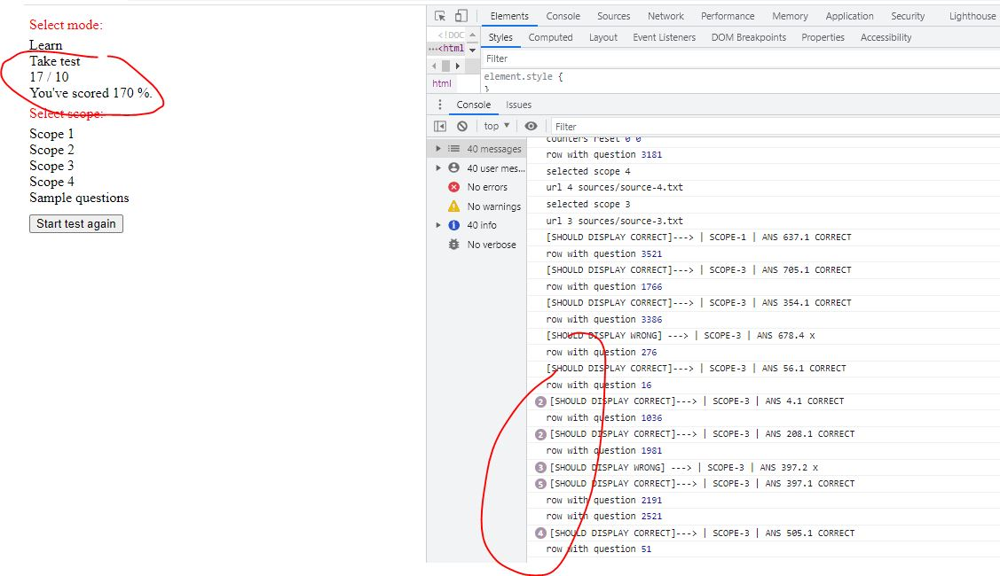
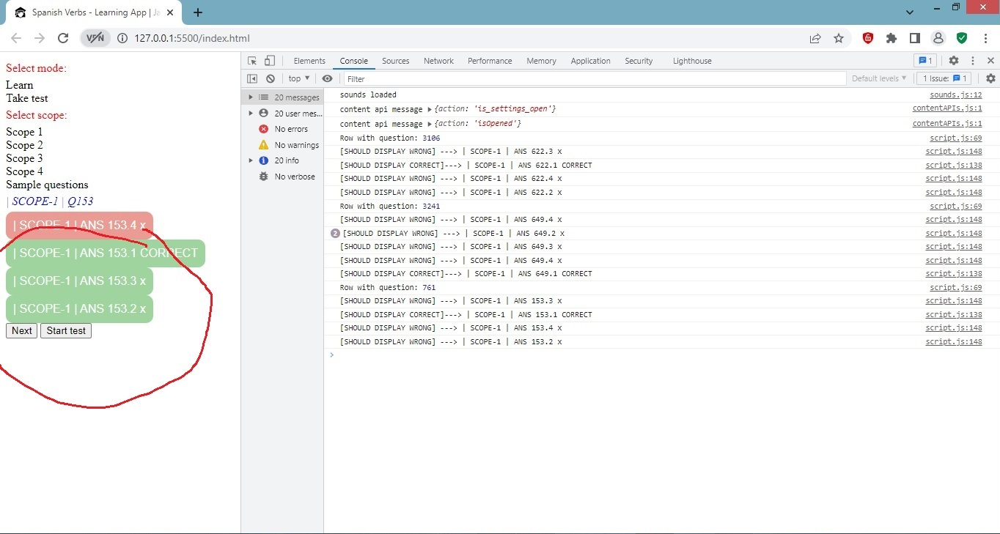

# Project Description: Spanish Verbs Learning App
## Why This Project?
Mastering Spanish verb conjugations can be challenging due to the complexity of the language. Verbs may sound similar across various tenses and modes, making memorization difficult. Traditional learning apps often mimic textbook methods, which might not suit everyone's learning style. This project was born out of a personal need to learn Spanish conjugations organically, through sentences and context.

## How the App Works:
The app offers two modes: learning and testing. In the learning mode, users can provide multiple answers, both correct and incorrect, to reinforce learning. They can proceed to the next question at their own pace. In testing mode, users must provide a single answer, and questions are generated automatically. Correct answers are indicated in green, while incorrect ones are marked in red. The addition of sounds adds a fun element to the learning experience. The test mode calculates scores, which are reset upon retaking the test.
## Features:
-	Responsive design ensures the app works seamlessly across various devices.
-	Questions and answers are sourced from text files, allowing for easy expansion and customization.
-	Answers are shuffled for each question to provide a randomized learning experience.
## Bugs and Testing:
During development, several bugs were encountered and resolved:
Bug 1: The app consistently crashed on the last question from the source file. This was caused by an incorrect definition of the variable "multiplier".

Bug 2: The answer was never updated, which was caused by an insufficient number of iterations in the 'for' loop. I used the length of a mutated array as a condition.

Bug 3: In the code, I utilized the Math.random method to check for the possibility of displaying the same question twice in a row. I inadvertently called the displayQuestion() function a high number of times, revealing such a case in the source code with 100 questions. This may not be a problem with 1000 questions in the source file.

Bug 4: The question was not displayed due to an incorrectly prepared input text file.

Bug 5: Even after displaying the test result, it was still possible to click on answers, causing the counter of correct and incorrect questions to increase.

Bug 6: The final percentage score was not reset after completing the test.

Bug 7: After ending the test, the answer button was displayed as empty grey circles. I added relevant DOM methods to remove CSS classes.

Bug 8: The percentage score was calculated incorrectly.

Bug 9: Allowing multiple clicks during tests distorted the score calculation. I disabled this option so that answers can only be clicked once, and a new question is displayed automatically after 0.5 seconds.

Bug 10: There was a problem with adding and removing classes, resulting in incorrect coloring of correct and incorrect answers.

## Future Considerations:
-	Populate source files with conjugations to enhance the learning value.
-	Implement automatic generation of questions when changing scopes or selecting multiple scopes.
-	Ensure seamless sound playback and address any overlapping issues.
-	Prevent the repetition of questions in smaller source files through code enhancements.
-	Enhance user experience with better design and animations.
## Summary:
This project showcases a frontend developer’s skill in utilizing essential programming concepts such as fetch, promises (including catch and then methods), array manipulation, functions, timeout functions, and DOM manipulation. Its focus on providing a dynamic and engaging learning experience for mastering Spanish conjugations highlights its educational value and potential for further improvements and enhancements.

**Demo Version:** [DEMO]( https://meljaszuk.github.io/Spanish-Verbs-Learning-App)
**Code Repository:** [CODE]( https://github.com/meljaszuk/Spanish-Verbs-Learning-App)

